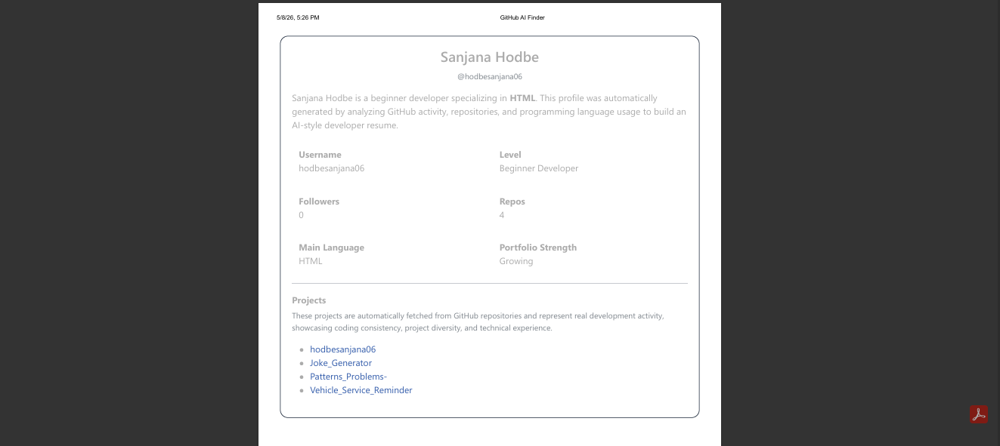

# 🚀 GitHub Profile Finder

A simple web application that allows users to search GitHub profiles using a username and generate a developer resume from GitHub activity. It uses the GitHub API to fetch and display real-time user information in a clean and responsive UI.
---

## 🌟 Features

- 🔍 Search GitHub users by username  
- 👤 Display user profile details  
- 📊 Show followers, following, repositories count & Active Language
- 📝 Generate resume from GitHub profile data
- ⚡ Real-time data using GitHub API  
- 📱 Responsive design for all devices  

---

## 🛠️ Tech Stack

- HTML  
- Bootstrap 5.3.0  
- JavaScript  
- GitHub REST API  

---

## 📂 Project Structure

```bash
Github_Profile_Analyzer/
│
├── index.html
├── index.js
└── imges/
    ├── front.png
    ├── git_info.png
    ├── resume_section.png
    └── prin.png
```

---

## ⚙️ How to Run This Project

```bash
# Clone repository
git clone https://github.com/your-username/github_profile_analyzer.git

# Go inside folder
cd github_profile_analyzer

# Open index.html in browser
```
---
## Screenshots

<br>

<br>

<br>



